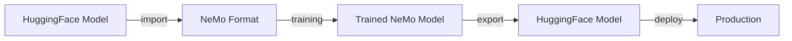

# 🔄 模型轉換 - HuggingFace ↔ NeMo 格式轉換完整指南

本模組將詳細介紹如何在 HuggingFace 和 NeMo 格式之間進行模型轉換，包括支援的模型架構、轉換步驟、檢查點管理和常見問題解決。

## 📋 目錄

- [轉換概述](#轉換概述)
- [支援的模型架構](#支援的模型架構)
- [HuggingFace → NeMo 轉換](#huggingface--nemo-轉換)
- [NeMo → HuggingFace 轉換](#nemo--huggingface-轉換)
- [檢查點管理](#檢查點管理)
- [模型驗證](#模型驗證)
- [進階轉換技巧](#進階轉換技巧)
- [故障排除](#故障排除)

---

## 🔍 轉換概述

### 為什麼需要模型轉換？

| 格式 | 優勢 | 適用場景 |
|------|------|----------|
| **HuggingFace** | 生態豐富、易於部署、社群支援 | 推理、微調、模型分享 |
| **NeMo** | 高效訓練、分散式支援、記憶體最佳化 | 大規模訓練、持續預訓練 |

### 轉換流程概覽



---

## 🏗️ 支援的模型架構

### 完全支援的模型

| 模型系列 | HF → NeMo | NeMo → HF | 版本支援 |
|----------|-----------|-----------|----------|
| **Llama/Llama 2/Llama 3** | ✅ | ✅ | 7B, 13B, 70B |
| **Mistral** | ✅ | ✅ | 7B |
| **Mixtral** | ✅ | ✅ | 8x7B |
| **Falcon** | ✅ | ✅ | 7B, 40B |
| **GPT-NeoX** | ✅ | ✅ | 20B |
| **Qwen** | ✅ | ✅ | 7B, 14B |

### 實驗性支援

| 模型系列 | 狀態 | 注意事項 |
|----------|------|----------|
| **Gemma** | 🧪 | 需要特殊配置 |
| **Phi** | 🧪 | 有限功能支援 |
| **CodeLlama** | 🧪 | 基於 Llama 架構 |

---

## 📥 HuggingFace → NeMo 轉換

### 步驟 1：下載 HuggingFace 模型

```bash
# 設定 HuggingFace Token
export HF_TOKEN="your_huggingface_token"
huggingface-cli login --token $HF_TOKEN

# 下載模型
huggingface-cli download meta-llama/Llama-3.1-8B-Instruct \
    --local-dir Llama-3.1-8B-Instruct \
    --local-dir-use-symlinks=False
```

### 步驟 2：使用 NeMo CLI 轉換

```bash
# 基礎轉換
MODEL_TYPE=llama3_8b
HF_MODEL_ID=Llama-3.1-8B-Instruct
OUTPUT_PATH=nemo_ckpt/Llama-3.1-8B-Instruct

nemo llm import -y \
    model=${MODEL_TYPE} \
    source=hf://${HF_MODEL_ID} \
    output_path=${OUTPUT_PATH}
```

### 步驟 3：驗證轉換結果

```bash
# 檢查輸出檔案
ls -la ${OUTPUT_PATH}/

# 測試模型載入
python -c "
from nemo.collections.nlp.models.language_modeling.megatron_gpt_model import MegatronGPTModel
model = MegatronGPTModel.restore_from('${OUTPUT_PATH}')
print(f'✅ 模型載入成功，參數數量: {model.num_parameters():,}')
"
```

---

## 📤 NeMo → HuggingFace 轉換

### 自動尋找最新檢查點

```bash
# 尋找最新的檢查點
LATEST_CHECKPOINT=$(find nemo_experiments/llama31_finetuning/checkpoints/ -type d -name "*-last" | sort -r | head -n 1)

if [ -z "$LATEST_CHECKPOINT" ]; then
    echo "❌ 未找到檢查點檔案"
    exit 1
fi

echo "📦 找到檢查點: $LATEST_CHECKPOINT"
```

### 執行轉換

```bash
# 設定輸出路徑
OUTPUT_PATH=hf_ckpt/llama31_finetuned

# 執行轉換
nemo llm export -y \
    path=${LATEST_CHECKPOINT} \
    output_path=${OUTPUT_PATH} \
    target=hf
```

### 驗證轉換結果

```bash
# 驗證 HuggingFace 模型
python -c "
from transformers import AutoTokenizer, AutoModelForCausalLM
try:
    tokenizer = AutoTokenizer.from_pretrained('${OUTPUT_PATH}')
    model = AutoModelForCausalLM.from_pretrained('${OUTPUT_PATH}')
    print('✅ HuggingFace 模型載入成功')
    print(f'參數數量: {model.num_parameters():,}')
except Exception as e:
    print(f'❌ 驗證失敗: {e}')
"
```

---

## 📁 檢查點管理

### 檢查點管理腳本

```python
# checkpoint_manager.py
import os
import shutil
from pathlib import Path
from datetime import datetime

class CheckpointManager:
    def __init__(self, base_dir: str = "checkpoints"):
        self.base_dir = Path(base_dir)
        self.base_dir.mkdir(exist_ok=True)
    
    def list_nemo_checkpoints(self):
        """列出所有 NeMo 檢查點"""
        checkpoints = []
        for path in self.base_dir.rglob("*.nemo"):
            stat = path.stat()
            checkpoints.append({
                "path": str(path),
                "name": path.stem,
                "size_gb": stat.st_size / 1e9,
                "modified": datetime.fromtimestamp(stat.st_mtime)
            })
        return sorted(checkpoints, key=lambda x: x["modified"], reverse=True)
    
    def list_hf_checkpoints(self):
        """列出所有 HuggingFace 檢查點"""
        checkpoints = []
        for path in self.base_dir.rglob("config.json"):
            parent = path.parent
            if (parent / "pytorch_model.bin").exists():
                size = sum(f.stat().st_size for f in parent.rglob("*") if f.is_file())
                checkpoints.append({
                    "path": str(parent),
                    "name": parent.name,
                    "size_gb": size / 1e9,
                    "modified": datetime.fromtimestamp(parent.stat().st_mtime)
                })
        return sorted(checkpoints, key=lambda x: x["modified"], reverse=True)
    
    def backup_checkpoint(self, source_path: str, backup_name: str = None):
        """備份檢查點"""
        source = Path(source_path)
        
        if backup_name is None:
            backup_name = f"{source.stem}_backup_{datetime.now().strftime('%Y%m%d_%H%M%S')}"
        
        backup_path = self.base_dir / "backups" / backup_name
        backup_path.parent.mkdir(exist_ok=True)
        
        if source.is_file():
            shutil.copy2(source, backup_path)
        else:
            shutil.copytree(source, backup_path)
        
        print(f"💾 檢查點已備份至: {backup_path}")

# 使用範例
if __name__ == "__main__":
    manager = CheckpointManager()
    
    print("📦 NeMo 檢查點:")
    for cp in manager.list_nemo_checkpoints():
        print(f"  {cp['name']} - {cp['size_gb']:.2f}GB - {cp['modified']}")
    
    print("\n🤗 HuggingFace 檢查點:")
    for cp in manager.list_hf_checkpoints():
        print(f"  {cp['name']} - {cp['size_gb']:.2f}GB - {cp['modified']}")
```

---

## ✅ 模型驗證

### 完整驗證腳本

```python
# model_validator.py
import torch
from transformers import AutoTokenizer, AutoModelForCausalLM
from nemo.collections.nlp.models.language_modeling.megatron_gpt_model import MegatronGPTModel

def validate_conversion(hf_path: str, nemo_path: str, test_prompt: str = "Hello, how are you?"):
    """驗證轉換是否成功"""
    print("🔍 開始驗證模型轉換...")
    
    # 驗證 HuggingFace 模型
    print("\n🤗 驗證 HuggingFace 模型:")
    try:
        tokenizer = AutoTokenizer.from_pretrained(hf_path)
        model = AutoModelForCausalLM.from_pretrained(hf_path, torch_dtype=torch.bfloat16)
        
        inputs = tokenizer(test_prompt, return_tensors="pt")
        with torch.no_grad():
            outputs = model.generate(
                inputs.input_ids,
                max_new_tokens=30,
                do_sample=True,
                temperature=0.7,
                pad_token_id=tokenizer.eos_token_id
            )
        
        hf_response = tokenizer.decode(outputs[0], skip_special_tokens=True)
        print(f"✅ HF 模型載入成功")
        print(f"📊 參數數量: {model.num_parameters():,}")
        print(f"💬 回應: {hf_response}")
        
    except Exception as e:
        print(f"❌ HF 模型驗證失敗: {e}")
        return False
    
    # 驗證 NeMo 模型
    print("\n🚀 驗證 NeMo 模型:")
    try:
        nemo_model = MegatronGPTModel.restore_from(nemo_path)
        
        nemo_response = nemo_model.generate(
            inputs=[test_prompt],
            length_params={"max_length": len(test_prompt.split()) + 30},
            sampling_params={"temperature": 0.7, "top_p": 0.9}
        )
        
        print(f"✅ NeMo 模型載入成功")
        print(f"📊 參數數量: {nemo_model.num_parameters():,}")
        print(f"💬 回應: {nemo_response[0]}")
        
    except Exception as e:
        print(f"❌ NeMo 模型驗證失敗: {e}")
        return False
    
    print("\n🎉 模型轉換驗證完成！")
    return True

if __name__ == "__main__":
    # 測試路徑
    hf_path = "hf_ckpt/llama31_finetuned"
    nemo_path = "nemo_ckpt/Llama-3.1-8B-Instruct"
    
    # 執行驗證
    validate_conversion(hf_path, nemo_path, "請問什麼是人工智慧？")
```

---

## 🔧 故障排除

### 常見問題與解決方案

#### 問題 1：記憶體不足
```bash
# 使用 CPU 進行轉換
nemo llm import -y \
    model=llama3_8b \
    source=hf://meta-llama/Llama-3.1-8B-Instruct \
    output_path=nemo_ckpt/Llama-3.1-8B-Instruct \
    trainer.devices=0
```

#### 問題 2：模型架構不匹配
```bash
# 手動指定模型配置
nemo llm import -y \
    model=llama3_8b \
    source=hf://model_path \
    model_config.num_layers=32 \
    model_config.hidden_size=4096 \
    model_config.ffn_hidden_size=11008
```

#### 問題 3：權限問題
```bash
# 檢查檔案權限
ls -la nemo_ckpt/
chmod -R 755 nemo_ckpt/

# 檢查 HuggingFace Token
huggingface-cli whoami
```

### 診斷工具

```bash
# 檢查模型資訊
python -c "
from transformers import AutoConfig
config = AutoConfig.from_pretrained('model_path')
print(f'模型類型: {config.model_type}')
print(f'層數: {getattr(config, \"num_hidden_layers\", \"未知\")}')
print(f'隱藏維度: {getattr(config, \"hidden_size\", \"未知\")}')
"
```

---

## 🎯 最佳實踐

### 轉換前準備
1. **備份原始模型**
2. **檢查可用空間**（建議至少是模型大小的 3 倍）
3. **確認模型架構支援**
4. **設定正確的環境變數**

### 轉換流程建議
```bash
# 1. 建立工作目錄
mkdir -p conversion_workspace/{hf_models,nemo_models,backups}

# 2. 下載並驗證原始模型
cd conversion_workspace
huggingface-cli download model_name --local-dir hf_models/model_name

# 3. 執行轉換
nemo llm import -y \
    model=model_type \
    source=hf://hf_models/model_name \
    output_path=nemo_models/model_name

# 4. 驗證轉換結果
python model_validator.py hf_models/model_name nemo_models/model_name

# 5. 備份重要檢查點
cp -r nemo_models/model_name backups/model_name_$(date +%Y%m%d)
```

---

## 🎯 下一步

完成模型轉換後，您可以繼續：

1. **[資料準備](../data_preparation/README.md)** - 準備訓練資料
2. **[預訓練](../pretraining/README.md)** - 開始持續預訓練  
3. **[微調](../finetuning/README.md)** - 進行指令微調
4. **[評估](../evaluation/README.md)** - 測試模型性能

---

## 📚 參考資料

- [NeMo 模型轉換文檔](https://docs.nvidia.com/deeplearning/nemo/user-guide/docs/en/stable/nlp/nemo_megatron/intro.html)
- [HuggingFace 模型文檔](https://huggingface.co/docs/transformers/model_doc/)
- [支援的模型列表](https://github.com/NVIDIA/NeMo/blob/main/docs/source/nlp/models.rst)

---

> 💡 **提示**：建議先用較小的模型測試轉換流程，確認無誤後再處理大型模型。轉換過程可能需要較長時間，請耐心等待。 