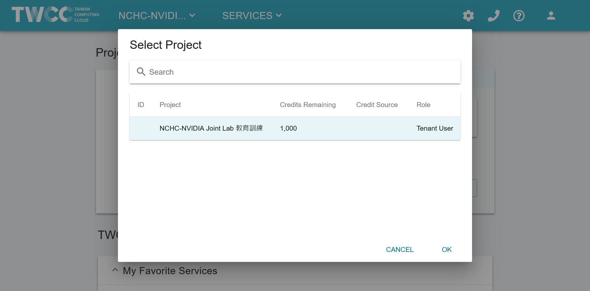
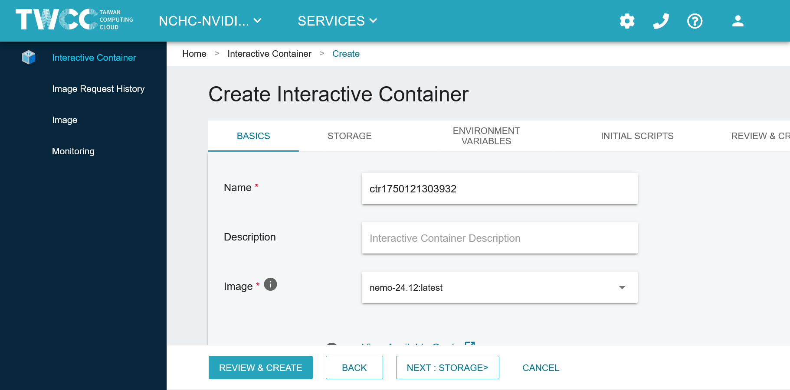

# TWCC 環境設定指南 🛠️

本指南專為在 TWCC (Taiwan Computing Cloud) 平台上進行 LLM Bootcamp 訓練而設計。TWCC 提供免費的 GPU 資源供教育使用，無需自行安裝 Docker 或設定複雜的本地環境。

## 📖 目錄

- [🎯 開始之前](#🎯-開始之前)
- [📋 建立 TWCC 容器](#📋-建立-twcc-容器)
- [🔧 環境設定](#🔧-環境設定)
- [✅ 環境驗證](#✅-環境驗證)
- [🗑️ 容器管理](#🗑️-容器管理)
- [❓ 故障排除](#❓-故障排除)

---

## 🎯 開始之前

### 📝 需要準備的資料
- **TWCC 帳號**：請先在 [TWCC](https://www.twcc.ai) 註冊帳號

### ⏰ 注意事項
- ⚠️ **重要**：完成教學後務必刪除容器以避免用盡額度
- 💡 **提示**：建議先閱讀完整指南再開始操作
- 🕐 **時間**：容器建立通常需要 3-5 分鐘

---

## 📋 建立 TWCC 容器

### 步驟 1：登入 TWCC

1. 訪問 [TWCC](https://www.twcc.ai) 並點擊 `登入`
   

2. 輸入您的電子郵件和密碼，透過 iService 登入
   

3. 登入後會重新導向到用戶儀表板
   

### 步驟 2：選擇計畫

4. 點擊左上角下拉選單，選擇「國網教育訓練用計畫」
   > ⚠️ **重要**：這是避免其他錢包產生費用的關鍵步驟
   

### 步驟 3：建立開發型容器

5. 點擊第二個下拉選單：`服務 > 開發型容器`
   

6. 點擊 `建立`
   

7. 搜尋 `nemo` 並點擊它
   

8. 選擇容器映像 `nemo-24.12:latest`，然後向下滾動
   

9. 選擇 `c.super` (V100 GPU x1) 配置類型，然後點擊 `檢視與建立`
   

10. 再次確認您使用的是正確的錢包「國網教育訓練用計畫」，然後點擊 `建立`
    

### 步驟 4：等待容器啟動

11. 等待容器初始化完成。幾分鐘後可以點擊 `重新整理` 檢查狀態
    > ⚠️ **重要提醒**：完成教學後，務必檢查容器並點擊 `刪除` 以避免用盡所有額度
    

12. 當容器顯示 `Ready` 時，點擊容器名稱進入詳細頁面
    

13. 向下滾動容器詳細頁面
    

### 步驟 5：啟動 Jupyter

14. 在 `Jupyter` 行點擊 `啟動` 按鈕開啟 Jupyter Notebook
    

15. 點擊 `New`，然後點擊 `Terminal` 開啟終端
    
    

16. 現在您可以在終端中執行指令
    

---

## 🔧 環境設定

### 複製專案並設定工作環境

在 Jupyter 終端中執行以下指令：

```bash
# 複製 NeMo Tutorial 專案
cd ~
git clone https://github.com/wcks13589/LLM-Tutorial.git
ls -al LLM-Tutorial

echo "✅ 基礎環境設定完成！"
```

---

## 🗑️ 容器管理

### ⚠️ 重要：完成後刪除容器

完成教學後，**務必**刪除容器以避免用盡所有額度：

1. 回到 TWCC 容器列表頁面
2. 找到您建立的容器
3. 點擊 `刪除` 按鈕
4. 確認刪除

容器列表應該是空的：


---

## ❓ 故障排除

### 🔧 常見問題解決

#### 1. pip 安裝時出現意外錯誤

如果您過去使用過 TWCC，在 `pip install` 時可能會遇到錯誤：

```bash
# 備份並移除衝突的目錄
mv ~/.local ~/.local.bak
mv ~/.bashrc ~/.bashrc.bak

# 重新啟動容器，然後重新執行環境設定步驟
```

#### 2. click.core 導入錯誤

遇到此錯誤訊息時：
```
ImportError: cannot import name 'ParameterSource' from 'click.core'
```

**解決方案**：
```bash
pip install -U click
```

#### 3. 磁碟配額超出

**錯誤範例**：
```
error: copy-fd: write returned: Disk quota exceeded
```

**解決步驟**：

1. 檢查儲存空間配額是否低於 100GiB
   

2. 清理不必要的檔案，確保使用空間低於 100GB
   

3. 在 HFS 用戶入口網站申請「國網教育訓練用計畫」
   

#### 4. sudo 權限問題

遇到此錯誤時：
```
env: 'rm': Permission denied
```

**解決方案**：
```bash
# 編輯 ~/.bashrc，註釋掉 sudo 別名
# alias sudo='sudo env PATH=$PATH'

# 重新載入設定
source ~/.bashrc
```

## 🎯 下一步

環境設定完成後，您可以：

1. **📚 閱讀主要 README.md**：了解完整的訓練流程
2. **🔄 開始模型轉換**：將 Hugging Face 模型轉換為 NeMo 格式
3. **📊 進行預訓練**：使用自定義資料集進行持續預訓練
4. **🎛️ 執行微調**：針對特定任務進行模型微調
5. **🧠 嘗試 Reasoning 微調**：提升模型推理能力

**祝您在 TWCC 上的 LLM 學習之旅順利！🚀**

---